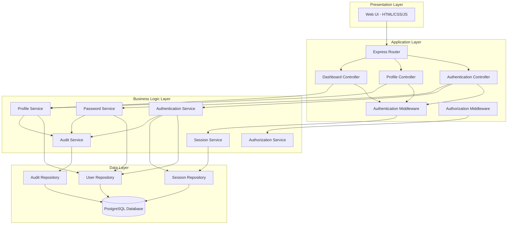
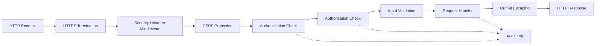

# Design Document: Patient Portal with Secure Authentication

## Overview

The Patient Portal with Secure Authentication is a web-based application that provides secure access to hospital services for patients. The system implements industry-standard authentication mechanisms including password hashing with bcrypt, session-based authentication with secure cookies, comprehensive audit logging, and role-based access control.

The architecture follows a layered approach with clear separation between presentation (web UI), application logic (authentication, authorization, profile management), and data persistence. This design prioritizes security, maintainability, and extensibility to support future features like medical records, appointments, and billing.

### Key Design Decisions

1. **Session-based authentication** over JWT tokens for better server-side control and immediate revocation capability
2. **Bcrypt for password hashing** with a work factor of 12 for strong protection against brute force attacks
3. **PostgreSQL database** for reliable ACID transactions and audit log integrity
4. **Express.js framework** for the web application layer with TypeScript for type safety
5. **Layered architecture** to isolate concerns and facilitate testing

## Architecture



### Security Architecture



## Components and Interfaces

### Authentication Service

Responsible for user registration, login, and credential verification.

```typescript
interface AuthenticationService {
  /**
   * Register a new patient account
   * @throws EmailAlreadyExistsError if email is already registered
   * @throws InvalidPasswordError if password doesn't meet requirements
   */
  register(
    email: string,
    password: string,
    firstName: string,
    lastName: string,
    dateOfBirth: Date,
    phoneNumber: string,
    address: Address
  ): Promise<User>;

  /**
   * Authenticate a patient and create a session
   * @throws InvalidCredentialsError if credentials are invalid
   * @throws AccountLockedError if account is temporarily locked
   */
  login(email: string, password: string, ipAddress: string, userAgent: string): Promise<Session>;

  /**
   * Verify if credentials are valid
   * Records failed attempts and enforces account lockout
   */
  verifyCredentials(email: string, password: string): Promise<boolean>;

  /**
   * Check if account is locked due to failed login attempts
   */
  isAccountLocked(email: string): Promise<boolean>;
}
```

### Session Service

Manages session lifecycle, validation, and expiration.

```typescript
interface SessionService {
  /**
   * Create a new session for authenticated user
   * Generates cryptographically random session ID
   */
  createSession(userId: string, ipAddress: string, userAgent: string): Promise<Session>;

  /**
   * Validate session and extend expiration if valid
   * @returns null if session is invalid or expired
   */
  validateAndExtendSession(sessionId: string): Promise<Session | null>;

  /**
   * Invalidate a session (logout)
   */
  invalidateSession(sessionId: string, reason: LogoutReason): Promise<void>;

  /**
   * Invalidate all sessions for a user except the current one
   * Used when password is changed
   */
  invalidateAllSessionsExcept(userId: string, currentSessionId: string): Promise<void>;

  /**
   * Clean up expired sessions
   * Should be run periodically
   */
  cleanupExpiredSessions(): Promise<number>;
}
```

### Password Service

Handles password hashing, validation, and changes.

```typescript
interface PasswordService {
  /**
   * Hash a password using bcrypt with work factor 12
   */
  hashPassword(password: string): Promise<string>;

  /**
   * Verify a password against a hash
   */
  verifyPassword(password: string, hash: string): Promise<boolean>;

  /**
   * Validate password meets security requirements
   * - Minimum 8 characters
   * - At least one uppercase letter
   * - At least one lowercase letter
   * - At least one number
   * - At least one special character
   */
  validatePasswordStrength(password: string): ValidationResult;

  /**
   * Change user password
   * @throws InvalidPasswordError if current password is wrong
   * @throws SamePasswordError if new password equals current
   */
  changePassword(
    userId: string,
    currentPassword: string,
    newPassword: string
  ): Promise<void>;
}
```

### Profile Service

Manages patient profile information.

```typescript
interface ProfileService {
  /**
   * Get patient profile by user ID
   */
  getProfile(userId: string): Promise<PatientProfile>;

  /**
   * Update patient profile
   * @throws EmailAlreadyExistsError if new email is already in use
   * @throws ImmutableFieldError if attempting to change date of birth
   */
  updateProfile(
    userId: string,
    updates: ProfileUpdateRequest,
    requiresReauth: boolean
  ): Promise<PatientProfile>;

  /**
   * Validate profile update request
   */
  validateProfileUpdate(updates: ProfileUpdateRequest): ValidationResult;
}
```

### Authorization Service

Implements role-based access control.

```typescript
interface AuthorizationService {
  /**
   * Check if user has permission to perform action on resource
   */
  hasPermission(userId: string, action: string, resource: string): Promise<boolean>;

  /**
   * Get all permissions for a user's role
   */
  getPermissions(userId: string): Promise<Permission[]>;

  /**
   * Assign role to user (used during registration)
   */
  assignRole(userId: string, role: Role): Promise<void>;
}
```

### Audit Service

Records security-relevant events for compliance and monitoring.

```typescript
interface AuditService {
  /**
   * Log an audit event
   * Events are immutable once created
   */
  logEvent(event: AuditEvent): Promise<void>;

  /**
   * Query audit logs for a user
   * Used for security investigations
   */
  getAuditLogsForUser(userId: string, startDate: Date, endDate: Date): Promise<AuditEvent[]>;

  /**
   * Query audit logs by event type
   */
  getAuditLogsByType(eventType: AuditEventType, startDate: Date, endDate: Date): Promise<AuditEvent[]>;
}
```

## Data Models

### User

```typescript
interface User {
  id: string;                    // UUID
  email: string;                 // Unique, indexed
  passwordHash: string;          // Bcrypt hash
  firstName: string;
  lastName: string;
  dateOfBirth: Date;             // Immutable after creation
  phoneNumber: string;
  address: Address;
  role: Role;                    // Currently always 'patient'
  failedLoginAttempts: number;   // Reset on successful login
  lockedUntil: Date | null;      // Null if not locked
  createdAt: Date;
  updatedAt: Date;
}

interface Address {
  street: string;
  city: string;
  state: string;
  zipCode: string;
  country: string;
}

enum Role {
  PATIENT = 'patient'
  // Future: DOCTOR, NURSE, ADMIN, etc.
}
```

### Session

```typescript
interface Session {
  id: string;                    // Cryptographically random, indexed
  userId: string;                // Foreign key to User
  ipAddress: string;
  userAgent: string;
  createdAt: Date;
  expiresAt: Date;               // 30 minutes from last activity
  invalidated: boolean;          // True if explicitly logged out
}
```

### AuditEvent

```typescript
interface AuditEvent {
  id: number;                    // Sequential ID for ordering
  userId: string | null;         // Null for failed login attempts
  eventType: AuditEventType;
  timestamp: Date;               // Indexed
  ipAddress: string;
  userAgent: string;
  outcome: 'success' | 'failure';
  details: Record<string, any>;  // JSON field for event-specific data
  hash: string;                  // Hash of previous event for tamper detection
}

enum AuditEventType {
  ACCOUNT_CREATED = 'account_created',
  LOGIN_SUCCESS = 'login_success',
  LOGIN_FAILURE = 'login_failure',
  LOGOUT = 'logout',
  PASSWORD_CHANGED = 'password_changed',
  PROFILE_UPDATED = 'profile_updated',
  ACCESS_DENIED = 'access_denied',
  ACCOUNT_LOCKED = 'account_locked'
}
```

### Permission

```typescript
interface Permission {
  id: string;
  role: Role;
  action: string;                // e.g., 'read', 'write', 'delete'
  resource: string;              // e.g., 'profile', 'appointments', 'medical_records'
}

// Initial permissions for patient role
const PATIENT_PERMISSIONS: Permission[] = [
  { role: Role.PATIENT, action: 'read', resource: 'own_profile' },
  { role: Role.PATIENT, action: 'write', resource: 'own_profile' },
  { role: Role.PATIENT, action: 'read', resource: 'dashboard' }
];
```

## Database Schema

```sql
-- Users table
CREATE TABLE users (
  id UUID PRIMARY KEY DEFAULT gen_random_uuid(),
  email VARCHAR(255) UNIQUE NOT NULL,
  password_hash VARCHAR(255) NOT NULL,
  first_name VARCHAR(100) NOT NULL,
  last_name VARCHAR(100) NOT NULL,
  date_of_birth DATE NOT NULL,
  phone_number VARCHAR(20) NOT NULL,
  address_street VARCHAR(255) NOT NULL,
  address_city VARCHAR(100) NOT NULL,
  address_state VARCHAR(50) NOT NULL,
  address_zip_code VARCHAR(20) NOT NULL,
  address_country VARCHAR(100) NOT NULL,
  role VARCHAR(50) NOT NULL DEFAULT 'patient',
  failed_login_attempts INTEGER NOT NULL DEFAULT 0,
  locked_until TIMESTAMP,
  created_at TIMESTAMP NOT NULL DEFAULT NOW(),
  updated_at TIMESTAMP NOT NULL DEFAULT NOW()
);

CREATE INDEX idx_users_email ON users(email);
CREATE INDEX idx_users_locked_until ON users(locked_until) WHERE locked_until IS NOT NULL;

-- Sessions table
CREATE TABLE sessions (
  id VARCHAR(255) PRIMARY KEY,
  user_id UUID NOT NULL REFERENCES users(id) ON DELETE CASCADE,
  ip_address VARCHAR(45) NOT NULL,
  user_agent TEXT NOT NULL,
  created_at TIMESTAMP NOT NULL DEFAULT NOW(),
  expires_at TIMESTAMP NOT NULL,
  invalidated BOOLEAN NOT NULL DEFAULT FALSE
);

CREATE INDEX idx_sessions_user_id ON sessions(user_id);
CREATE INDEX idx_sessions_expires_at ON sessions(expires_at);

-- Audit events table
CREATE TABLE audit_events (
  id SERIAL PRIMARY KEY,
  user_id UUID REFERENCES users(id) ON DELETE SET NULL,
  event_type VARCHAR(50) NOT NULL,
  timestamp TIMESTAMP NOT NULL DEFAULT NOW(),
  ip_address VARCHAR(45) NOT NULL,
  user_agent TEXT NOT NULL,
  outcome VARCHAR(20) NOT NULL,
  details JSONB,
  hash VARCHAR(64) NOT NULL
);

CREATE INDEX idx_audit_events_user_id ON audit_events(user_id);
CREATE INDEX idx_audit_events_timestamp ON audit_events(timestamp);
CREATE INDEX idx_audit_events_event_type ON audit_events(event_type);

-- Permissions table
CREATE TABLE permissions (
  id UUID PRIMARY KEY DEFAULT gen_random_uuid(),
  role VARCHAR(50) NOT NULL,
  action VARCHAR(50) NOT NULL,
  resource VARCHAR(100) NOT NULL,
  UNIQUE(role, action, resource)
);

CREATE INDEX idx_permissions_role ON permissions(role);

-- Insert initial patient permissions
INSERT INTO permissions (role, action, resource) VALUES
  ('patient', 'read', 'own_profile'),
  ('patient', 'write', 'own_profile'),
  ('patient', 'read', 'dashboard');
```


## Correctness Properties

*A property is a characteristic or behavior that should hold true across all valid executions of a system—essentially, a formal statement about what the system should do. Properties serve as the bridge between human-readable specifications and machine-verifiable correctness guarantees.*

### Property 1: Account Creation with Unique Identifiers

*For any* valid registration data (email, password, name, date of birth, phone, address), when a patient registers, the system should create a new account with a unique identifier that differs from all existing account identifiers.

**Validates: Requirements 1.1**

### Property 2: Password Hashing for All Passwords

*For any* password provided during registration or password change, the stored value in the database should be a cryptographic hash (not the plaintext password), and verifying the original password against the hash should succeed.

**Validates: Requirements 1.2, 5.3**

### Property 3: Duplicate Email Rejection

*For any* email address already associated with an existing account, attempting to register a new account with that email should be rejected with a descriptive error.

**Validates: Requirements 1.3, 4.3**

### Property 4: Password Strength Validation

*For any* password that violates security requirements (less than 8 characters, missing uppercase, missing lowercase, missing number, or missing special character), the system should reject it during registration or password change. Conversely, any password meeting all requirements should be accepted.

**Validates: Requirements 1.4, 5.2**

### Property 5: Patient Role Assignment

*For any* newly registered account, the account should have exactly one role assigned, and that role should be 'patient'.

**Validates: Requirements 1.5**

### Property 6: Comprehensive Audit Logging

*For any* security-relevant event (account creation, login success, login failure, logout, password change, profile update, access denial), an audit log entry should be created containing timestamp, user identifier (or null for failed logins), event type, IP address, user agent, and outcome.

**Validates: Requirements 1.6, 2.5, 3.4, 4.4, 5.5, 8.1**

### Property 7: Credential Verification Round Trip

*For any* registered account, logging in with the correct email and password should succeed, while logging in with the same email but incorrect password should fail.

**Validates: Requirements 2.1, 2.3**

### Property 8: Session Creation on Successful Login

*For any* successful login, a new session should be created with a cryptographically random session identifier (non-sequential, non-predictable), and the session should be associated with the authenticated user.

**Validates: Requirements 2.2**

### Property 9: Session Extension on Activity

*For any* valid session, making an authenticated request should extend the session expiration time by 30 minutes from the time of the request.

**Validates: Requirements 3.1**

### Property 10: Session Invalidation on Logout

*For any* active session, explicitly logging out should immediately invalidate the session such that subsequent requests with that session identifier are rejected.

**Validates: Requirements 3.3**

### Property 11: Secure Cookie Configuration

*For any* session created, the session identifier cookie should have the httpOnly, secure, and sameSite attributes set to prevent client-side access and CSRF attacks.

**Validates: Requirements 3.5**

### Property 12: Authentication Enforcement

*For any* protected resource (dashboard, profile), attempting to access it without a valid session should result in redirection to the login page rather than displaying the protected content.

**Validates: Requirements 3.6**

### Property 13: Profile Retrieval Completeness

*For any* authenticated patient, requesting their profile should return all personal information fields (name, email, phone, date of birth, address) with values matching what was stored during registration or last update.

**Validates: Requirements 4.1**

### Property 14: Profile Update Validation

*For any* profile update request with invalid data (invalid email format, invalid phone format, missing required fields), the system should reject the update and return validation errors for the specific invalid fields.

**Validates: Requirements 4.2**

### Property 15: Date of Birth Immutability

*For any* registered patient, attempting to update the date of birth field should be rejected, regardless of the new value provided.

**Validates: Requirements 4.6**

### Property 16: Current Password Verification for Password Change

*For any* password change request, if the provided current password is incorrect, the password change should be rejected. Only when the current password is correct should the change proceed.

**Validates: Requirements 5.1**

### Property 17: Session Invalidation on Password Change

*For any* user with multiple active sessions, when the password is changed in one session, all other sessions should be invalidated while the current session remains valid.

**Validates: Requirements 5.4**

### Property 18: Same Password Rejection

*For any* password change request where the new password is identical to the current password, the system should reject the change with an appropriate error.

**Validates: Requirements 5.6**

### Property 19: Authorization Check for Protected Resources

*For any* patient attempting to access a resource, the system should verify that the patient role has explicit permission for that resource. Access should be granted only if permission exists, and denied otherwise.

**Validates: Requirements 6.2**

### Property 20: Default Deny Authorization

*For any* resource not explicitly listed in the patient role's permissions, access attempts should be denied by default.

**Validates: Requirements 6.4**

### Property 21: Dashboard Welcome Message Personalization

*For any* authenticated patient accessing the dashboard, the welcome message displayed should contain the patient's first name and last name as stored in their profile.

**Validates: Requirements 7.2**

### Property 22: Audit Log Immutability

*For any* audit log entry that has been created, attempts to modify or delete the entry should fail, ensuring the audit trail remains tamper-evident.

**Validates: Requirements 8.3**

### Property 23: Sequential Audit Log Identifiers

*For any* sequence of audit events created, the identifiers should be strictly increasing integers with no gaps, maintaining a clear chronological ordering.

**Validates: Requirements 8.4**

### Property 24: Immediate Audit Log Persistence

*For any* audit event, immediately after the event is logged, querying the audit log should return the newly created entry, confirming immediate persistence to durable storage.

**Validates: Requirements 8.5**

### Property 25: Security Headers on All Responses

*For any* HTTP response from the portal, the response should include security headers (Content-Security-Policy, X-Frame-Options, X-Content-Type-Options, Strict-Transport-Security) with appropriate values.

**Validates: Requirements 9.1**

### Property 26: HTTPS Enforcement

*For any* HTTP request to the portal, the request should be redirected to the HTTPS equivalent URL, ensuring all traffic is encrypted.

**Validates: Requirements 9.2**

### Property 27: Input Sanitization

*For any* user input containing potentially malicious content (SQL injection patterns, script tags, command injection patterns), the system should either sanitize the input or reject it before processing.

**Validates: Requirements 9.3**

### Property 28: CSRF Protection

*For any* state-changing operation (registration, login, profile update, password change), requests without a valid CSRF token should be rejected.

**Validates: Requirements 9.4**

### Property 29: XSS Prevention through Output Escaping

*For any* user-generated content displayed in the UI (name, address fields), HTML special characters should be escaped to prevent script execution.

**Validates: Requirements 9.5**

### Property 30: Cache Control for Sensitive Pages

*For any* response containing sensitive data (profile page, dashboard), the response should include cache control headers (Cache-Control: no-store, no-cache) to prevent caching.

**Validates: Requirements 9.6**

### Property 31: Error Message Safety

*For any* error condition (invalid credentials, validation failure, system error), the error message displayed to the user should not contain sensitive system details (stack traces, database errors, file paths).

**Validates: Requirements 10.1**

### Property 32: Field-Specific Validation Errors

*For any* form submission with validation errors, the response should identify which specific fields failed validation and provide actionable guidance for each field.

**Validates: Requirements 10.2**

### Property 33: Error Logging vs Display Separation

*For any* system error, the full error details (stack trace, error type, context) should be logged to the system logs, while the user receives only a generic error message.

**Validates: Requirements 10.3**

## Error Handling

### Error Types and Handling Strategy

The system defines specific error types for different failure scenarios:

```typescript
class EmailAlreadyExistsError extends Error {
  constructor(email: string) {
    super(`Email ${email} is already registered`);
    this.name = 'EmailAlreadyExistsError';
  }
}

class InvalidPasswordError extends Error {
  constructor(message: string) {
    super(message);
    this.name = 'InvalidPasswordError';
  }
}

class InvalidCredentialsError extends Error {
  constructor() {
    super('Invalid email or password');
    this.name = 'InvalidCredentialsError';
  }
}

class AccountLockedError extends Error {
  constructor(unlockTime: Date) {
    super(`Account is locked until ${unlockTime.toISOString()}`);
    this.name = 'AccountLockedError';
  }
}

class SessionExpiredError extends Error {
  constructor() {
    super('Session has expired, please log in again');
    this.name = 'SessionExpiredError';
  }
}

class UnauthorizedError extends Error {
  constructor(resource: string) {
    super(`Access denied to resource: ${resource}`);
    this.name = 'UnauthorizedError';
  }
}

class ValidationError extends Error {
  constructor(public fields: Record<string, string>) {
    super('Validation failed');
    this.name = 'ValidationError';
  }
}

class ImmutableFieldError extends Error {
  constructor(field: string) {
    super(`Field ${field} cannot be modified`);
    this.name = 'ImmutableFieldError';
  }
}
```

### Error Handling Middleware

```typescript
// Global error handler for Express
function errorHandler(err: Error, req: Request, res: Response, next: NextFunction) {
  // Log full error details
  logger.error('Error occurred', {
    error: err.message,
    stack: err.stack,
    path: req.path,
    method: req.method,
    userId: req.session?.userId
  });

  // Determine response based on error type
  if (err instanceof EmailAlreadyExistsError) {
    return res.status(409).json({ error: err.message });
  }

  if (err instanceof InvalidPasswordError) {
    return res.status(400).json({ error: err.message });
  }

  if (err instanceof InvalidCredentialsError) {
    return res.status(401).json({ error: 'Invalid email or password' });
  }

  if (err instanceof AccountLockedError) {
    return res.status(423).json({ error: err.message });
  }

  if (err instanceof SessionExpiredError) {
    return res.status(401).json({ error: err.message, redirect: '/login' });
  }

  if (err instanceof UnauthorizedError) {
    return res.status(403).json({ error: 'Access denied' });
  }

  if (err instanceof ValidationError) {
    return res.status(400).json({ error: 'Validation failed', fields: err.fields });
  }

  if (err instanceof ImmutableFieldError) {
    return res.status(400).json({ error: err.message });
  }

  // Generic error for unexpected issues
  return res.status(500).json({ error: 'An unexpected error occurred. Please try again later.' });
}
```

### Validation Error Handling

Input validation should occur at multiple layers:

1. **Client-side validation**: Immediate feedback for user experience
2. **Request validation**: Validate request structure and types
3. **Business logic validation**: Validate business rules and constraints
4. **Database constraints**: Final safety net for data integrity

Each validation failure should provide specific, actionable feedback to help users correct their input.

## Testing Strategy

### Dual Testing Approach

The testing strategy employs both unit tests and property-based tests as complementary approaches:

- **Unit tests**: Verify specific examples, edge cases, and error conditions
- **Property-based tests**: Verify universal properties across all inputs

Together, these approaches provide comprehensive coverage where unit tests catch concrete bugs and property-based tests verify general correctness.

### Property-Based Testing Configuration

**Library Selection**: Use `fast-check` for TypeScript/JavaScript property-based testing

**Test Configuration**:
- Minimum 100 iterations per property test (due to randomization)
- Each property test must reference its design document property
- Tag format: `// Feature: patient-portal-auth, Property {number}: {property_text}`

**Example Property Test Structure**:

```typescript
import fc from 'fast-check';

describe('Property Tests - Authentication', () => {
  // Feature: patient-portal-auth, Property 2: Password Hashing for All Passwords
  it('should hash all passwords and never store plaintext', async () => {
    await fc.assert(
      fc.asyncProperty(
        fc.string({ minLength: 8 }), // Generate random passwords
        async (password) => {
          const user = await authService.register(
            `test-${Date.now()}@example.com`,
            password,
            'John',
            'Doe',
            new Date('1990-01-01'),
            '555-0100',
            { street: '123 Main', city: 'Boston', state: 'MA', zipCode: '02101', country: 'USA' }
          );

          // Verify stored password is not plaintext
          const storedHash = await userRepo.getPasswordHash(user.id);
          expect(storedHash).not.toBe(password);

          // Verify password verification works
          const isValid = await passwordService.verifyPassword(password, storedHash);
          expect(isValid).toBe(true);
        }
      ),
      { numRuns: 100 }
    );
  });
});
```

### Unit Testing Focus

Unit tests should focus on:

1. **Specific examples**: Concrete scenarios that demonstrate correct behavior
2. **Edge cases**: Boundary conditions (empty strings, maximum lengths, special characters)
3. **Error conditions**: Specific error scenarios (account lockout after 3 failures, session expiration after 30 minutes)
4. **Integration points**: Interactions between components (middleware chains, database transactions)

**Example Unit Test**:

```typescript
describe('Unit Tests - Account Lockout', () => {
  it('should lock account after 3 failed login attempts for 15 minutes', async () => {
    // Register a user
    const user = await authService.register(
      'test@example.com',
      'ValidPass123!',
      'John',
      'Doe',
      new Date('1990-01-01'),
      '555-0100',
      testAddress
    );

    // Fail login 3 times
    for (let i = 0; i < 3; i++) {
      await expect(
        authService.login('test@example.com', 'WrongPassword', '127.0.0.1', 'test-agent')
      ).rejects.toThrow(InvalidCredentialsError);
    }

    // Verify account is locked
    await expect(
      authService.login('test@example.com', 'ValidPass123!', '127.0.0.1', 'test-agent')
    ).rejects.toThrow(AccountLockedError);

    // Verify lockout duration is 15 minutes
    const lockedUser = await userRepo.findByEmail('test@example.com');
    const lockDuration = lockedUser.lockedUntil.getTime() - Date.now();
    expect(lockDuration).toBeGreaterThanOrEqual(14 * 60 * 1000); // At least 14 minutes
    expect(lockDuration).toBeLessThanOrEqual(15 * 60 * 1000); // At most 15 minutes
  });
});
```

### Test Coverage Goals

- **Line coverage**: Minimum 80%
- **Branch coverage**: Minimum 75%
- **Property test coverage**: All 33 correctness properties implemented
- **Critical path coverage**: 100% for authentication, authorization, and audit logging

### Integration Testing

Integration tests should verify:

1. **End-to-end flows**: Complete user journeys (registration → login → profile update → logout)
2. **Database transactions**: Proper rollback on errors, consistency across tables
3. **Session management**: Cookie handling, session persistence, expiration
4. **Audit logging**: Events logged correctly across all operations
5. **Security headers**: Proper headers on all responses

### Security Testing

Security-specific tests should include:

1. **SQL injection**: Attempt SQL injection in all input fields
2. **XSS attacks**: Submit script tags and verify escaping
3. **CSRF attacks**: Attempt state changes without CSRF tokens
4. **Session hijacking**: Verify session IDs are unpredictable
5. **Password brute force**: Verify account lockout mechanism
6. **Timing attacks**: Verify consistent response times for invalid credentials

### Performance Testing

Performance tests should verify:

1. **Password hashing**: Bcrypt operations complete within acceptable time (< 500ms)
2. **Session lookup**: Session validation completes within 50ms
3. **Database queries**: All queries use proper indexes and complete within 100ms
4. **Concurrent logins**: System handles 100 concurrent login requests
5. **Audit log writes**: Non-blocking, don't slow down primary operations

## Implementation Notes

### Technology Stack

- **Runtime**: Node.js 18+ with TypeScript 5+
- **Web Framework**: Express.js 4.18+
- **Database**: PostgreSQL 14+
- **Password Hashing**: bcrypt 5+
- **Session Storage**: PostgreSQL (can be moved to Redis for scale)
- **Testing**: Jest 29+ with fast-check 3+
- **Logging**: Winston 3+

### Security Considerations

1. **Password Storage**: Use bcrypt with work factor 12 (adjustable for future hardware)
2. **Session IDs**: Generate using crypto.randomBytes(32) for 256 bits of entropy
3. **HTTPS Only**: Enforce HTTPS in production, use HSTS headers
4. **Rate Limiting**: Implement rate limiting on login endpoint (10 attempts per IP per minute)
5. **SQL Injection**: Use parameterized queries exclusively, never string concatenation
6. **XSS Prevention**: Use templating engine with auto-escaping (e.g., EJS, Handlebars)
7. **CSRF Protection**: Use csurf middleware for all state-changing operations
8. **Security Headers**: Use helmet middleware for comprehensive header management

### Scalability Considerations

1. **Session Storage**: Current design uses PostgreSQL; can migrate to Redis for horizontal scaling
2. **Audit Logs**: Consider partitioning audit_events table by date for large volumes
3. **Password Hashing**: Bcrypt is CPU-intensive; consider queuing for async processing at scale
4. **Database Connections**: Use connection pooling (pg-pool) with appropriate limits
5. **Caching**: Add Redis caching for user profiles and permissions at scale

### Monitoring and Observability

1. **Metrics to Track**:
   - Login success/failure rates
   - Account lockout frequency
   - Session creation/expiration rates
   - Password change frequency
   - Audit log write latency

2. **Alerts to Configure**:
   - High login failure rate (potential attack)
   - Unusual account lockout patterns
   - Audit log write failures
   - Database connection pool exhaustion
   - High password hashing latency

3. **Logging Strategy**:
   - Structured JSON logs for machine parsing
   - Log levels: ERROR (system failures), WARN (security events), INFO (user actions), DEBUG (development)
   - Include correlation IDs for request tracing
   - Separate audit logs from application logs

### Future Extensions

This design provides the foundation for future features:

1. **Medical Records**: Authorization framework ready for additional resources
2. **Appointments**: Session management supports booking workflows
3. **Billing**: Audit logging captures all financial transactions
4. **Notifications**: User profile includes contact information (email, phone)
5. **Multi-factor Authentication**: Session management can be extended for MFA flows
6. **Provider Portal**: Role-based access control supports additional roles (doctor, nurse, admin)
